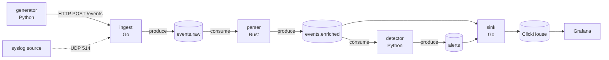

# Architecture

## Data flow

## Topic contracts

All topics on Redpanda. Keys are SHA-256 of `tenant_id|source` so a
given source's events stay ordered on a single partition.

### `events.raw`
Schema: [`schemas/event.raw.schema.json`](schemas/event.raw.schema.json).
Whatever the ingest layer received, plus `received_at`,
`ingest_node_id`. Untrusted, unparsed.

### `events.enriched`
Schema: [`schemas/event.enriched.schema.json`](schemas/event.enriched.schema.json).
Parsed timestamp (RFC 3339 UTC), normalized severity, extracted
`src_ip` / `dst_ip` / `host` / `user`, GeoIP city + country code,
`event_class` (auth, network, dns, ...), `parser_version`.

### `alerts`
Schema: [`schemas/alert.schema.json`](schemas/alert.schema.json). One
alert per detection. Carries the matched rule id (Sigma) or model name
(anomaly), score, and the source event id for join-back.

## Why these languages

- **Go** for ingest + sink. Predictable concurrency primitives and
  excellent first-party Kafka/HTTP/syslog client maturity make it a
  natural fit for IO-heavy edges of the pipeline.
- **Rust** for parser. The parser is the only stage that does
  byte-level work (timestamp parsing, regex enrichment, GeoIP lookups)
  on every event. It's the most CPU-bound step, where Rust earns its
  keep.
- **Python** for detector + generator. PySigma is the canonical
  Sigma-rule engine, and scikit-learn / numpy give us Isolation Forest
  in a few lines. Generator stays Python so the synthetic-event corpus
  is easy to extend.

## Why Redpanda + ClickHouse

- **Redpanda** speaks the Kafka protocol but runs as a single binary
  with no ZooKeeper, which keeps the Compose stack small. Drop-in
  swappable with Kafka in production.
- **ClickHouse** is built for the access pattern this system creates:
  high-cardinality columnar inserts plus fast aggregations over time
  windows. It's also the de-facto choice for SOC analytics
  (e.g. SigNoz, OpenObserve, Uptrace), so the Grafana dashboards
  translate to real-world setups.

## Out of scope (v0.1)

- Kubernetes manifests / Helm chart — Compose for the MVP, K8s
  deferred to v0.2.
- C++ parser — Rust covers the systems-language signal.
- Webhook / Slack alerting — alerts log to stdout for the MVP.
- Trained-on-real-data anomaly model — synthetic feature space is
  enough to demonstrate the integration.
